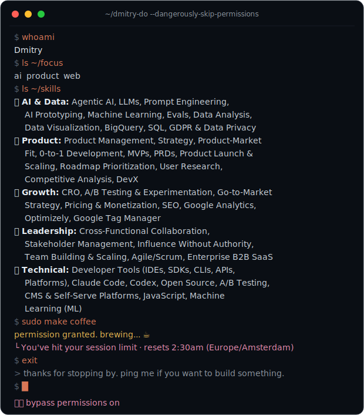

<div align="center">



</div>

```shell
$ whoami
Dmitry

$ ls ~/focus
ai  product  web

$ ls ~/skills
🤖 AI & Data: Agentic AI, LLMs, Prompt Engineering, AI Prototyping, Machine Learning,
   Evals, Data Analysis, Data Visualization, BigQuery, SQL, GDPR & Data Privacy
🧭 Product: Product Management, Strategy, Product-Market Fit, 0-to-1 Development,
   MVPs, PRDs, Product Launch & Scaling, Roadmap Prioritization, User Research,
   Competitive Analysis, DevX
📈 Growth: CRO, A/B Testing & Experimentation, Go-to-Market Strategy, Pricing &
   Monetization, SEO, Google Analytics, Optimizely, Google Tag Manager
🤝 Leadership: Cross-Functional Collaboration, Stakeholder Management, Influence
   Without Authority, Team Building & Scaling, Agile/Scrum, Enterprise B2B SaaS
🧰 Technical: Developer Tools (IDEs, SDKs, CLIs, APIs, Platforms), Claude Code,
   Codex, Open Source, A/B Testing, CMS & Self-Serve Platforms, JavaScript,
   Machine Learning (ML)

$ sudo make coffee
permission granted. brewing... ☕
└ You've hit your session limit · resets 2:30am (Europe/Amsterdam)

$ exit
> thanks for stopping by. ping me if you want to build something.

⏵⏵ bypass permissions on
```
